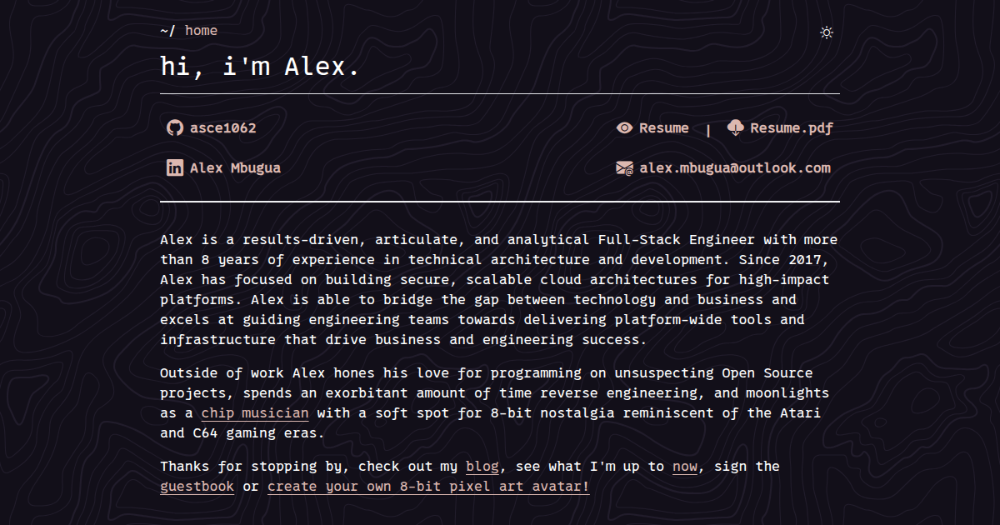

# [Website](https://alexmbugua.me/) [](https://app.netlify.com/projects/alexmbugua/deploys)



- Personal site/portfolio/blog.
- Built with [Astro](https://astro.build/) and [TailwindCSS](https://tailwindcss.com/).
- Dark and light modes with a responsive, mobile-friendly design.

## Table of Contents

- [Website ](#website-)
  - [Table of Contents](#table-of-contents)
  - [Development](#development)
  - [Deployment](#deployment)
    - [Deploying With GitHub Pages (Deploy from a branch)](#deploying-with-github-pages-deploy-from-a-branch)
      - [GitHub Pages Notes](#github-pages-notes)
    - [Deploying With Netlify](#deploying-with-netlify)
      - [Setup: Link Repository to Netlify (One-time)](#setup-link-repository-to-netlify-one-time)
        - [Using Netlify UI (Recommended for first-time setup)](#using-netlify-ui-recommended-for-first-time-setup)
        - [Using Netlify CLI (For local development and manual deploys)](#using-netlify-cli-for-local-development-and-manual-deploys)
        - [Why use npx vs global install?](#why-use-npx-vs-global-install)
      - [Local Development with Netlify Features](#local-development-with-netlify-features)
      - [Automatic Git Deployment (Recommended)](#automatic-git-deployment-recommended)
      - [Manual CLI Deployment](#manual-cli-deployment)
      - [Netlify Configuration](#netlify-configuration)
      - [Netlify Dev Notes](#netlify-dev-notes)
      - [Troubleshooting Netlify Builds](#troubleshooting-netlify-builds)

## Development

1. Clone the source code to your device

```sh
git clone git@github.com:asce1062/asce1062.git
```

or

```sh
git clone https://github.com/asce1062/asce1062.git
```

2. Navigate to working directory

```sh
cd asce1062/asce1062
```

3. Install the project's dependencies.

```sh
npm install
```

4. Start the development server on `localhost:4321`

```sh
npm run dev
```

5. Build the site to `/dist`.

```sh
npm run build
```

## Deployment

This site supports two deployment methods: **GitHub Pages** and **Netlify**. You can use either or both.

### Deploying With GitHub Pages (Deploy from a branch)

1. Run Pre-deploy script.

```sh
npm run predeploy
```

2. Start `/dist` preview server on `localhost:4321`

```sh
npm run preview
```

3. Run deploy script.

```sh
npm run deploy
```

#### GitHub Pages Notes

- Built on node 24
- `/dist` output from step #5 `npm run build` can be deployed using workflows,
  or to any other platform that can host static files
- For github branch deploys
  - Jekyll "ignores" directories/files with underscores
    [Issue #55](https://github.com/jekyll/jekyll/issues/55). This is a feature
    not a bug (they are treated as "special")

  - Adding a `.nojekyll` does not
    [bypass Jekyll on GitHub pages](https://github.blog/news-insights/bypassing-jekyll-on-github-pages/)
    for us

  - To address this we tell Astro to build out our assets in a directory without
    a leading underscore
    - in our `astro.config.mjs`

      ```javascript
        build: {
          assets: 'astro'
        },
      ```

- We use a [gh-pages](https://www.npmjs.com/package/gh-pages) integration in our
  `deploy` script,
  `gh-pages -d dist --branch alexmbugua --nojekyll --cname alexmbugua.me --dotfiles`,
  that does a couple of things for us:
  1. `-d dist` tells `gh-pages` to deploy the contents of the dist folder. This
     is the output directory from our Astro build
  2. `--branch alexmbugua` deploys to my custom branch named `alexmbugua`
     instead of the default `gh-pages` branch.
  3. `--nojekyll` creates a `.nojekyll` file that disables GitHub Pages'
     built-in Jekyll processing on branch deploys.
  4. `--cname alexmbugua.me` creates a file named `CNAME` in the root of the
     deployed branch with the content:

     ```cname
     alexmbugua.me
     ```

     - This tells `github-pages` to map the site to my custom domain
       [alexmbugua.me](https://alexmbugua.me/).
     - _CNAME record for `www` in the apex domain provider should point to
       `<username>.github.io`_

  5. `--dotfiles` tells `gh-pages` to include hidden files (dotfiles) in the
     deployment.

### Deploying With Netlify

#### Setup: Link Repository to Netlify (One-time)

Before deploying, you need to link your repository to Netlify. Choose either the UI method (easier) or CLI method (more control).

##### Using Netlify UI (Recommended for first-time setup)

1. Log in to [Netlify](https://app.netlify.com/)

2. Click **"Add new project"** → **"Import an existing project"**

3. Choose your Git provider (GitHub, GitLab, or Bitbucket)
   - Click **"GitHub"**
   - Authorize Netlify to access your GitHub account if prompted

4. Select your repository
   - Search for `asce1062/asce1062`
   - Click on the repository to select it

5. Configure build settings
   - **Base directory:** `asce1062` (since the project is in a subdirectory)
   - **Build command:** `npm run build`
   - **Publish directory:** `asce1062/dist`
   - **Branch to deploy:** `main`

6. Add environment variables (click **"Show advanced"** → **"New variable"**)
   - `GUESTBOOK_ID`: Your guestbook ID
   - `NETLIFY_ACCESS`: Your Netlify access token
   - `NODE_VERSION`: `22`

7. Click **"Deploy project"**

8. Configure custom domain (optional)
   - Go to **Project** → **Domain management**
   - Click **"Add custom domain"**
   - Enter `alexmbugua.me`
   - Follow DNS configuration instructions
   - Netlify will automatically provision SSL certificate

9. (Optional) Update site name
   - Go to **Project** → **configuration** → **general** → **project-details**
   - Click **"Change project name"**
   - Enter `alexmbugua` (makes URL `alexmbugua.netlify.app`)

##### Using Netlify CLI (For local development and manual deploys)

The Netlify CLI is already included as a devDependency in this project. You can use it with `npx` (no global install needed) or install it globally for convenience.

1. **Choose your CLI method:**

   **Option 1: Use local installation with npx (Recommended - no global install needed)**

   ```sh
   npx netlify --version  # Verify it's installed
   ```

   **Option 2: Install globally (Optional - for convenience)**

   ```sh
   npm install -g netlify-cli
   netlify --version      # Verify installation
   ```

   For the rest of these instructions, use either:
   - `npx netlify <command>` (if using local installation)
   - `netlify <command>` (if installed globally)

2. Authenticate with Netlify

   ```sh
   npx netlify login
   # or
   netlify login
   ```

   This opens a browser window to authorize the CLI. Grant access and return to terminal.

3. Link your local repository to Netlify site

   **If you know the site name (quickest method):**

   ```sh
   npx netlify link --name alexmbugua
   # or
   netlify link --name alexmbugua
   ```

   **Interactive linking (choose from options):**

   ```sh
   npx netlify link
   # or
   netlify link
   ```

   Choose one of the following options:
   - **Use current git remote origin:** Automatically detects GitHub repo
   - **Search by full or partial site name:** Enter `alexmbugua`
   - **Choose from a list of your sites:** Browse and select
   - **Enter a site ID:** Use site ID from dashboard

4. Verify the link

   ```sh
   npx netlify status
   # or
   netlify status
   ```

   This displays your site information, including:
   - Site name and ID
   - Custom domain
   - Repository
   - Deploy URL

5. (Optional) Set local environment variables

   Create a `.env` file (already in `.gitignore`):

   ```sh
   touch .env
   ```

   Edit `.env` and add your values:

   ```env
   GUESTBOOK_ID=your_guestbook_id
   NETLIFY_ACCESS=your_access_token
   ```

   Note: Netlify CLI automatically uses `.env` file for local development.

##### Why use npx vs global install?

- **npx (Recommended):**
  - Uses the version bundled with the project
  - No permission issues
  - Ensures everyone uses same CLI version
  - No global installation needed

- **Global install:**
  - Shorter commands (`netlify` vs `npx netlify`)
  - Available in any directory
  - Useful if working with multiple Netlify projects

#### Local Development with Netlify Features

Test Netlify-specific features locally (environment variables, functions, redirects).

1. Start Netlify Dev server on `localhost:8888`

```sh
npm run preview:netlify
```

2. The Netlify Dev server:
   - Proxies your Astro dev server (running on `localhost:4321`)
   - Injects environment variables from Netlify dashboard
   - Simulates Netlify redirects and headers
   - Provides access to Netlify Functions (if configured)

#### Automatic Git Deployment (Recommended)

Once linked via UI or CLI, the site automatically deploys whenever you push to the `main` branch.

1. Push your changes to GitHub.

```sh
git add .
git commit -m "Your commit message"
git push origin main
```

2. Netlify automatically:
   - Detects the push via GitHub integration
   - Runs `npm run build` using Node 22
   - Deploys the `/dist` directory
   - Runs Netlify plugins for optimization and quality assurance

3. Monitor the deployment at [Netlify Dashboard](https://app.netlify.com/sites/alexmbugua/deploys)

**Deploy Notifications:**

Enable deploy notifications in Netlify dashboard:

- Go to **Project** → **Project configuration** → **notifications** or **Project** → **Deploys** → **Notifications**
- Add notifications for:
  - **Deploy succeeded** (email, Slack, webhook)
  - **Deploy failed** (email, Slack, webhook)
  - **Deploy started** (webhook only)

#### Manual CLI Deployment

For manual deployments or testing, use the Netlify CLI.

**Deploy Preview/Draft:**

```sh
npm run deploy:netlify:preview
```

**Deploy to Production:**

```sh
npm run deploy:netlify
```

#### Netlify Configuration

The site is configured via `netlify.toml` with:

**Build Settings:**

- **Build command:** `npm run build`
- **Publish directory:** `dist`
- **Node version:** 22
- **Build optimization:** `--legacy-peer-deps` flag for npm

**Contexts:**

- **Production:** Deploys from `main` branch with `NODE_ENV=production`
- **Deploy Preview:** Automatic preview builds for pull requests
- **Branch Deploys:** Automatic deploys for other branches

**Security Headers:**

- `X-Frame-Options: DENY` - Prevents clickjacking
- `X-XSS-Protection: 1; mode=block` - XSS protection
- `X-Content-Type-Options: nosniff` - MIME type sniffing protection
- `Referrer-Policy: strict-origin-when-cross-origin` - Referrer policy
- `Permissions-Policy` - Restricts camera, microphone, geolocation

**Cache Control:**

- **1 year cache** for immutable assets (JS, CSS, fonts)
- **1 week cache** for images (PNG, JPG, WebP)
- **Aggressive caching** for `/astro/*` directory

**Redirects:**

- 404 fallback to `/404.html`

**Netlify Plugins:**

1. **@netlify/plugin-sitemap** - Automatically generates sitemap
2. **@netlify/plugin-lighthouse** - Runs performance audits with 90% thresholds
3. **netlify-plugin-checklinks** - Validates internal links (skips 404 pages)
4. **netlify-plugin-submit-sitemap** - Auto-submits sitemap to Google, Bing, and Yandex

**Environment Variables:**

Required variables (set in Netlify dashboard under Site settings → Environment variables):

- `GUESTBOOK_ID` - Guestbook integration ID
- `NETLIFY_ACCESS` - Netlify API access token

Auto-configured by Netlify:

- `NETLIFY=true` - Indicates Netlify environment
- `CONTEXT` - Deploy context (production, deploy-preview, branch-deploy)
- `NODE_ENV` - Set to `production` for production builds

**Custom Domain:**

The site is configured to use [alexmbugua.me](https://alexmbugua.me) as the custom domain.

1. Domain settings configured in Netlify dashboard
2. HTTPS automatically enabled via Let's Encrypt
3. DNS can use either:
   - Netlify DNS (automatically configured)
   - External DNS with CNAME pointing to `alexmbugua.netlify.app`

#### Netlify Dev Notes

- Use `npm run dev` for regular development, `npm run preview:netlify` only when
  testing Netlify-specific features

**Testing Netlify Features Locally:**

```sh
npm run preview:netlify
# Access site at http://localhost:8888
# Check Network tab to verify injected variables
# Test custom redirects and security headers
# Test form submissions locally
```

#### Troubleshooting Netlify Builds

**Build fails with "husky: not found":**

- This is expected - Husky is a devDependency for local git hooks
- The `prepare` script includes `|| true` to fail gracefully
- Netlify sets `NODE_ENV=production` which skips devDependencies

**Build fails with "failed to resolve import":**

- Check if the package is in `dependencies` (not `devDependencies`)
- Packages imported at runtime or build-time must be in `dependencies`
- Examples: `astro-themes`, `lightningcss`, `typescript`

**Plugin failures:**

- Check Netlify build logs for specific plugin errors
- Ensure plugin configurations in `netlify.toml` are correct
- Clear cache: Deploys → Trigger deploy → Clear cache and deploy site

**Environment variables not working:**

- Verify variables are set in Netlify dashboard
- Check variable scope (All, Production, Deploy Previews, Branch deploys)
- Variables are auto-injected at build time, not runtime
